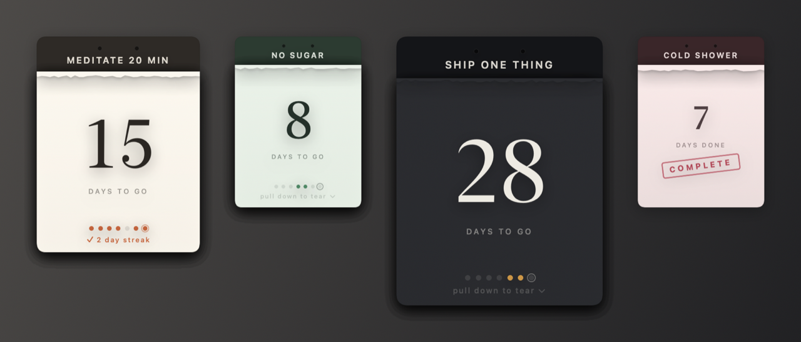

<h1 align="center">Tearoff</h1>

<p align="center">
  Paper tear-off pads that live on your Mac desktop.<br>
  One pad per goal, one sheet per day, torn off only after you've actually done the thing.
</p>

<p align="center">
  <a href="https://github.com/CoderMayhem/tearoff/actions/workflows/ci.yml"></a>
  
  
</p>

<p align="center"></p>

## Why

Habit apps nag you. A paper pad on your desk doesn't — it just sits there getting thinner,
and the only way it gets thinner is if you did the work. Tearoff is that, on your desktop:
set a count (21, 10, 66, whatever), and tear one sheet off per day. The stack visibly thins
as you go. There is no way to tear ahead, and nothing to dismiss.

## Install

**Download** the latest `Tearoff.zip` from [Releases](https://github.com/CoderMayhem/tearoff/releases),
unzip, and drag `Tearoff.app` to `/Applications`.

The app is ad-hoc signed, not notarised — Apple charges $99/year for that — so macOS will
refuse to open it on the first try. Either right-click the app → **Open** → **Open**, or:

```bash
xattr -dr com.apple.quarantine /Applications/Tearoff.app
```

**Or build it yourself**, which skips the quarantine dance entirely:

```bash
git clone https://github.com/CoderMayhem/tearoff.git
cd tearoff
./build.sh --install     # builds, signs, installs to /Applications, launches
```

Needs the Swift toolchain from Xcode (`xcode-select --install` is not enough — the app links
SwiftUI). macOS 14 Sonoma or later.

## Using it

Tearoff lives in the menu bar — no Dock icon, no window in your way. The number beside the
icon is how many pads still need tearing today; it disappears when you're caught up.

| Action | How |
| --- | --- |
| New pad | Menu bar → **New Pad…** |
| Tear today's sheet | Drag the sheet downward until it rips away |
| Move a pad | Drag it by the dark binding bar at the top |
| Change goal, size or paper | Right-click the pad |
| Undo a mistaken tear | Right-click → **Undo Today's Tear** |
| Find a pad you've lost | Menu bar → the pad → **Locate Pad**, or **Gather Pads on This Desktop** |
| Start a finished pad again | Right-click → **Start Over** |
| Put them away for a while | Menu bar → **Hide All Pads** |

Pads come in three sizes and six paper stocks, including a dark one. Any starting count from
1 to 999 — presets for 7, 10, 21, 30, 66 and 90.

## The rules it enforces

- **One tear per calendar day.** Pull at a pad you've already torn today and it gives a few
  points of slack, then springs back. There is no way to tear tomorrow's sheet tonight.
- **Undo only reaches today.** You can take back a mistaken tear; you cannot rewrite last week.
- **Missing a day costs you nothing but the truth.** Nothing resets, nothing scolds you. The
  seven dots on each sheet are the last seven days — filled where you tore, hollow where you
  didn't, ringed on today.
- **A streak survives until you actually miss a day**, not from midnight onwards. Tearing
  yesterday and not yet today still reads as a live streak.

## Where the pads sit

By default pads sit on the **desktop layer** — above the wallpaper and your desktop icons,
behind every app window, on the one desktop Space where you put them. They never cover your
work, never follow you to another Space, and never appear over a full-screen app. Clicking one
doesn't steal focus from what you were typing in.

If you'd rather they hover above everything, menu bar → **Keep Pads On Top**.

## Data and privacy

Everything lives in one plain JSON file:

```
~/Library/Application Support/Tearoff/pads.json
```

Your goals, the pad geometry, and every day you've torn. No network calls, no accounts, no
telemetry, no analytics — the app has no networking code at all. Back it up, edit it, or
delete it to start fresh. If the file is ever unreadable, Tearoff moves it to `pads.json.corrupt`
and starts empty rather than overwriting it.

## Uninstall

```bash
rm -rf /Applications/Tearoff.app
rm -rf ~/Library/Application\ Support/Tearoff
```

If you enabled **Open at Login**, remove it in System Settings → General → Login Items first.

## Development

```bash
swift test                                  # 30 tests over the model and store
swift build -c release                      # binary only
./build.sh                                  # → dist/Tearoff.app
TEAROFF_SHOT=docs/pads.png swift run -c release Tearoff   # regenerate the README screenshot
```

| Target | Contents |
| --- | --- |
| `Sources/TearoffCore` | `Pad`, day-key arithmetic, streak rules, JSON persistence. Pure Foundation — no AppKit, no SwiftUI, fully tested. |
| `Sources/Tearoff` | The app: pad windows, the tear gesture, menu bar, composer. |
| `Tests/TearoffCoreTests` | Day keys across DST, streak edge cases, tear/undo/reset, corrupt-file handling. |
| `tools/makeicon.swift` | Draws the app icon into an `.iconset`. |

Two AppKit details worth knowing before you touch `PadPanel.swift`:

- `.canJoinAllSpaces` puts pads on **every** Space and `.fullScreenAuxiliary` draws them over
  full-screen apps. Both look like bugs to the user.
- `.fullScreenNone` sounds like the fix for that and is a trap: it stops the panel from
  appearing at all. The working combination is `[.stationary, .ignoresCycle]` at
  `kCGDesktopIconWindowLevel + 1`.

Contributions welcome — see [CONTRIBUTING.md](CONTRIBUTING.md).

## Licence

Apache License 2.0 — see [LICENSE](LICENSE).
